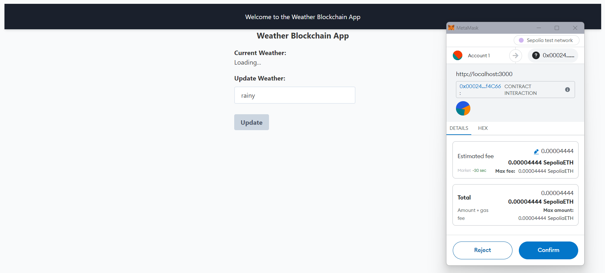

# Weather Blockchain App

  [](https://opensource.org/license/MIT)

  


## Table Of Content

- [Description](#description)
- [Technology](#technology)
- [Installation](#installation)
- [Usage](#usage)
- [Tools and Libraries](#tools-and-libraries)
- [Contributing](#contributing)
- [Contact](#contact)
- [License](#license)


## Description

  The Weather Blockchain App is a decentralized application (DApp) that allows users to check and update the current weather condition via Ethereum blockchain. It leverages smart contracts for reading and writing data, ensuring transparency and security. This project serves as a practical introduction to building DApps with React and Ethereum.


## Technology

- **React**: For building the user interface.
- **Ethers.js**: A library to interact with the Ethereum blockchain.
- **MetaMask**: As the Ethereum wallet provider.


<p>Deployed website: <strong><a href="http://blockchaincyberpunk1.github.io/blockchain-weather-app">http://blockchaincyberpunk1.github.io/blockchain-weather-app</a></strong>

<p align="center">
  <br>
Weather Blockchain App
</p>


## Installation

To run this project, follow these steps:

1. **Clone the repository**:
   ```bash
   git clone https://github.com/blockchaincyberpunk1/blockchain-weather-app.git
   cd frontend


## Tools and Libraries

- **React**: JavaScript library for building user interfaces.
- **ethers.js**: A complete Ethereum wallet implementation and utilities in JavaScript (and TypeScript).
- **dotenv**: Loads environment variables from a `.env` file into `process.env`.
- **Tailwind CSS**: A utility-first CSS framework for rapidly building custom designs.


## Usage
 
To use the app:

1. Ensure MetaMask is installed and logged in.
2. Visit the application URL (usually http://localhost:3000).
3. Interact with the application to check or update the weather.


## Contribution
 
Contributions are welcome! Please feel free to submit any issues or pull requests.


## Contact

Feel free to reach out to me on my email:
thepolyglot8@gmail.com


## License

[](https://opensource.org/license/MIT)


